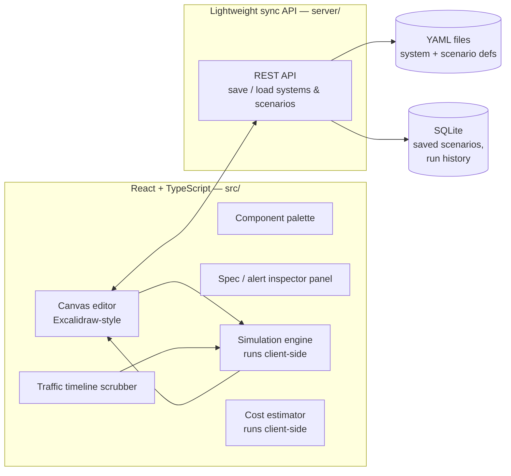

# Design Doc

## 1. Problem

Distributed-systems incidents (a downstream service slows down, a queue
backs up, a cache stampede hits the DB) are hard to reason about and even
harder to reproduce safely. Postmortems describe them in prose; nobody can
*see* the cascade. Separately, system design (for interviews, RFCs,
architecture reviews) is usually done on a generic whiteboard tool that has
no idea what a Kafka topic or an API gateway actually behaves like.

**Goal:** one tool that is both.

1. A visual canvas for defining real distributed-system topologies out of a
   fixed palette of real components (microservices, monoliths, CDNs,
   distributed DBs, Kafka/event streams, API gateways, load balancers,
   frontend clients...).
2. A simulator that plays traffic through that topology, animates the
   request/data flow, and lets you change one component's behavior live
   (e.g. bump a service's average latency from 50ms to 500ms) and watch how
   the change propagates and which alerts fire.
3. A library of preset architectures and preset incident scenarios so
   patterns (cascading failure, thundering herd, connection-pool
   exhaustion...) can be reproduced and studied on demand.

## 2. Core concepts

| Concept | What it is |
|---|---|
| **Component catalog** | Fixed, repo-controlled list of supported real-world component *types*. The canvas only ever offers this palette — you can't draw an arbitrary shape, only a supported component. |
| **System definition** | A YAML file describing one topology: a set of component instances (each an independent node with specs) and the edges between them. |
| **Scenario** | A YAML file describing traffic over time against a system definition: baseline load, load changes, and fault injections (e.g. "at t=30s set `orders-db` avg_response_time_ms to 500"). |
| **Simulation engine** | Runs client-side, in the browser: plays a scenario against a system definition tick-by-tick, computes propagated latency/saturation at every component, and evaluates alert rules — no server round trip needed per tick. |
| **Alert rule** | A per-component, per-metric threshold (p99 latency, error rate, saturation...) that fires a visible alert when crossed during simulation. |
| **Cost estimator** | Maps a system definition's component specs to a rough monthly cloud cost. |

## 3. Architecture

There is no "real" backend service — all the interesting logic (canvas,
simulation engine, cost estimator, alert evaluation) runs client-side in the
React app. The backend is a lightweight sync layer whose only job is to
save/load systems and scenarios so they persist and can be shared across
sessions/devices.



- **YAML files are the source of truth** for system/scenario designs —
  human-readable, diffable, portable, git-versionable, shareable outside the
  app.
- **SQLite** stores things that aren't part of the design itself: saved/named
  scenario runs, run history.
- **Component catalog** (`catalog/catalog.yaml`) is a single fixed file in
  the repo, bundled directly into the frontend build (no API call needed) —
  not user-editable at runtime, so extending the supported component list is
  a PR, not an app feature.

## 4. System definition schema

Each component is an independent node keyed by a stable id. Edges are
expressed as outbound `connects_to` references to other component ids —
this keeps the file diffable (moving/renaming an edge only touches the two
components involved) and lets the engine build a directed dependency graph
by scanning all nodes.

```yaml
# examples/systems/sample-ecommerce.yaml
version: 1
name: Sample E-commerce Microservices
description: Client -> gateway -> order service -> db + async event stream

components:
  web-client:
    type: react-spa
    specs:
      avg_response_time_ms: 0   # entrypoint, not a service being measured
    connects_to:
      - target: api-gateway
        protocol: https
        avg_payload_kb: 3

  api-gateway:
    type: kong
    specs:
      avg_response_time_ms: 5
      max_rps: 5000
    connects_to:
      - target: order-service
        protocol: http
        avg_payload_kb: 2
    alerts:
      - metric: p99_latency_ms
        threshold: 200
        severity: warning

  order-service:
    type: microservice
    specs:
      instances: 3
      cpu_cores: 1
      mem_mb: 512
      avg_response_time_ms: 50
      max_concurrent_workers: 100
    connects_to:
      - target: orders-db
        protocol: tcp
        avg_payload_kb: 1
      - target: order-events
        protocol: kafka
        avg_payload_kb: 1
    alerts:
      - metric: p99_latency_ms
        threshold: 300
        severity: warning
      - metric: error_rate
        threshold: 0.05
        severity: critical

  orders-db:
    type: postgres
    specs:
      avg_response_time_ms: 15
      max_connections: 200
    alerts:
      - metric: saturation
        threshold: 0.9
        severity: critical

  order-events:
    type: kafka
    specs:
      partitions: 6
      avg_response_time_ms: 8
```

**Field reference**

- `type` — must match a `name` in the component catalog (§5), e.g.
  `postgres`, `kafka`, `microservice`. This is the concrete technology; the
  catalog entry it resolves to carries its own internal `type` (the
  abstract behavioral class, e.g. `relational-db`) that the simulation
  engine uses to pick its formulas.
- `specs` — numeric knobs the simulation engine reads. Defaults come from
  the matching catalog entry and can be overridden per-instance here.
  Common ones:
  `avg_response_time_ms`, `instances`, `cpu_cores`, `mem_mb`,
  `max_concurrent_workers`, `max_rps`, `max_connections`. Unrecognized specs
  are allowed and just carried through (e.g. for the cost estimator or
  future metrics).
- `connects_to` — list of outbound edges: `target` (component id),
  `protocol`, `avg_payload_kb`.
- `alerts` — list of `{metric, threshold, severity}` evaluated against that
  component's live simulated metrics on every tick.

## 5. Component catalog schema

`catalog/catalog.yaml` is the fixed palette the canvas draws from: a flat
list under `components:` (comments mark groups for human scanning — client,
networking, compute, database, messaging, etl, serverless — but there's no
nested structure to walk). Every entry is a *concrete* real-world
technology, not an abstract placeholder — this is what makes the canvas
show a Postgres icon next to a Kafka icon instead of generic boxes.

The exception is `compute`: a Node service, a Go service, and a Spring Boot
service behave identically in the simulation, so compute stays generic
(`microservice`, `monolith`) rather than one entry per language/framework —
the specific stack is a deployment detail that doesn't belong in the
catalog.

Fields, and what each is for:

- `name` — the identifier a system definition's `type:` field (§4)
  references (`postgres`, `kafka`, `microservice`...).
- `type` — the abstract behavioral class the simulation engine uses to pick
  its latency/capacity formulas, and the primary grouping key at runtime
  (palette sections, filters). Multiple `name`s can share a `type`
  (`postgres` and `mysql` are both `relational-db`).
- `description` — one-liner shown in the palette/tooltip.
- `icon-url` — `/icons/<name>.svg`; assets live in `public/icons/`.
- `tags` — free-form multi-select labels (`[sql, oltp, self-hosted]`,
  `[serverless, aws, managed]`...) for filtering/search. Extensible — the
  simulation engine doesn't read these, so new tags never require code
  changes.
- everything else — default specs, flattened directly onto the entry (no
  nested wrapper). These are what a new component instance starts with; a
  system definition can override any of them per-instance.

```yaml
components:
  # client
  - name: react-spa
    type: frontend-client
    description: Single-page web app client
    icon-url: /icons/react.svg
    tags: [frontend, spa]
    avg_response_time_ms: 0

  # networking
  - name: kong
    type: api-gateway
    description: Open-source API gateway
    icon-url: /icons/kong.svg
    tags: [gateway, self-hosted]
    avg_response_time_ms: 5
    max_rps: 5000

  # compute — generic; language/framework is a deployment detail
  - name: microservice
    type: microservice
    description: Stateless web service or API worker
    icon-url: /icons/microservice.svg
    tags: [compute, stateless]
    instances: 1
    cpu_cores: 1
    mem_mb: 256
    avg_response_time_ms: 50
    max_concurrent_workers: 50

  # database
  - name: postgres
    type: relational-db
    description: Open-source relational database
    icon-url: /icons/postgres.svg
    tags: [sql, oltp, self-hosted]
    avg_response_time_ms: 10
    max_connections: 100
  - name: snowflake
    type: data-warehouse
    description: Managed cloud data warehouse
    icon-url: /icons/snowflake.svg
    tags: [warehouse, olap, managed]
    avg_response_time_ms: 200
    max_connections: 100

  # etl / data pipeline
  - name: spark
    type: batch-processor
    description: Distributed batch/stream data processing engine
    icon-url: /icons/spark.svg
    tags: [etl, big-data, self-hosted]
    avg_response_time_ms: 2000
    max_concurrent_workers: 100

  # serverless
  - name: aws-lambda
    type: serverless-function
    description: Managed function-as-a-service compute on AWS
    icon-url: /icons/aws.svg
    tags: [serverless, aws, managed]
    avg_response_time_ms: 100
    max_concurrent_workers: 1000
```

(Full list — ~30 entries across all groups, including columnar/data-warehouse
DBs, Kubernetes/Docker/Envoy/Istio, Airflow/Databricks, and AWS Step
Functions/EventBridge — lives in `catalog/catalog.yaml` itself; the above
is illustrative.)

AWS-branded entries all reuse `/icons/aws.svg` (a generic AWS mark) since
neither open icon set used here ships per-service AWS icons — see
`public/icons/CREDITS.md`. Adding a new supported technology is a change to
this one file plus an icon asset — never an app-level feature.

## 6. Scenario / traffic definition schema

```yaml
# examples/incidents/db-latency-spike.yaml
version: 1
name: Orders DB Latency Spike
description: Baseline traffic, then orders-db degrades for 60s under load.
target_system: sample-ecommerce
entrypoint: web-client

baseline:
  rps: 200

timeline:
  - at_seconds: 0
    rps: 200
  - at_seconds: 30
    rps: 200
    inject_fault:
      component: orders-db
      set_specs:
        avg_response_time_ms: 500
    duration_seconds: 60
  - at_seconds: 90
    rps: 200
    clear_fault:
      component: orders-db
```

- `timeline` entries are checkpoints; the engine linearly interpolates `rps`
  between them.
- `inject_fault` overrides one or more `specs` on a target component for
  `duration_seconds` (or until `clear_fault` / end of run).
- Same shape supports both "burst traffic" scenarios (just `rps` changes)
  and "incident" scenarios (`inject_fault`), and the two can combine.

## 7. Simulation engine

Runs entirely client-side (`src/engine/`), as a discrete tick loop (default:
1 tick = 1 simulated second, configurable playback speed). No server round
trip per tick — the backend is only touched to load the system/scenario at
the start of a run and, optionally, to save the run afterward.

1. **Load propagation** — starting at `entrypoint`, push the current `rps`
   through the dependency graph (`connects_to` edges), splitting/merging at
   fan-out/fan-in points.
2. **Latency computation** — per component, effective response time is a
   simple queueing approximation: `effective_ms = avg_response_time_ms /
   (1 - min(utilization, 0.99))`, where `utilization = incoming_rps /
   max_rps_equivalent(specs)`. This is intentionally a coarse M/M/1-style
   approximation, not a full discrete-event simulator — good enough to show
   *that* things degrade and cascade, not to produce production-grade
   capacity planning numbers.
3. **Propagation** — a component's outbound edges see load only after the
   component itself responds, so a slow node visibly backs up everything
   downstream of it in the animation and inflates the p99 seen by everything
   upstream of it.
4. **Alert evaluation** — after each tick, every component's `alerts` are
   checked against that tick's computed metrics; a crossed threshold fires a
   visible alert in the canvas immediately (no server involved).
5. **Rendering** — each tick's per-component metrics + fired alerts drive the
   canvas animation and the alert panel directly in React state — this is
   what makes the "live tweak" interaction (§8) instant: changing a spec
   just re-runs the local engine, no request in the loop.

## 8. Frontend UX

Full layout, states, and interaction patterns — including how traffic gets
authored visually (draggable "load generator" tokens with an rps/concurrency
slider, feeding a scenario's `baseline`/`timeline`) — live in
[UX.md](UX.md), alongside a mockup of the canvas editor's core screens.

The one mechanic worth calling out here since §7 depends on it: **live
tweak** — while a simulation is running, changing a component's spec in the
inspector immediately re-computes and re-animates downstream effects. This
is the "click one service, set 50ms → 500ms, watch it cascade" interaction
from the mission statement, and it's why the simulation engine runs
client-side (§7) rather than round-tripping to a server per edit.

## 9. Backend API surface

The `server/` API exists purely to save/load/sync systems and scenarios —
everything else (catalog, simulation, cost estimate) is client-side and
needs no endpoint.

- `GET/POST /api/systems`, `GET/PUT/DELETE /api/systems/:id`
- `GET/POST /api/scenarios`, `GET/PUT/DELETE /api/scenarios/:id`
- `GET/POST /api/runs` — optionally save a completed simulation run's
  timeline/results for later review.

## 10. Persistence

- **YAML files** (`examples/**` bundled, plus user-created ones under a
  user data directory) are the portable, git-friendly source of truth for
  designs and scenarios.
- **SQLite** (`better-sqlite3`) holds: named saved scenario runs, simulation
  run history. Never the designs themselves — those stay as YAML so they can
  be copied/diffed/shared independent of the app.

## 11. Cost estimator

Runs client-side (`src/engine/cost.ts`): a small heuristic pricing table
(`$/instance/hour` by rough size class, `$/GB` for storage-ish components,
`$/million messages` for streams/queues) multiplies against each
component's `specs` (instances, cpu/mem tier, throughput) to produce a rough
monthly estimate per component and a system total. Explicitly labeled as a
ballpark, not a quote.

## 12. Presets

- `examples/systems/` — reference architectures (3-tier web app, event-driven
  order pipeline, CDN + origin, Kafka fan-out...).
- `examples/incidents/` — reference incident scenarios (DB connection-pool
  exhaustion, cascading downstream degradation, cache-stampede thundering
  herd, burst traffic without autoscaling...).

Both are loaded read-only in the UI as a "start from a preset" gallery.

## 13. Tech stack

| Layer | Choice |
|---|---|
| App (canvas, simulation engine, cost estimator) | React + TypeScript + Vite, standard `src/`/`public/` layout at repo root |
| Canvas | Custom SVG/Canvas renderer (Excalidraw-style interactions) |
| Sync API (`server/`) | Node.js + TypeScript + Fastify — thin REST layer for save/load/sync only, no simulation logic |
| Design/scenario storage | YAML files |
| Saved state / run history | SQLite (`better-sqlite3`) |
| Cloud hosting | Terraform (provisioning) + Ansible (config/deploy), top-level `terraform/` and `ansible/` |
| Local dev/preview | Makefile wrapping the app + sync server dev processes |

## 14. Roadmap

- **M0** — repo scaffold, docs, component catalog + example YAML (this).
- **M1** — static canvas: render a system definition YAML read-only on the
  canvas (no editing, no simulation).
- **M2** — CRUD: create/edit systems and scenarios through the UI, persisted
  as YAML via the `server/` sync API; SQLite wired up.
- **M3** — simulation engine v1 (`src/engine/`): run a scenario against a
  system, compute propagated metrics tick-by-tick, no animation yet
  (numbers/table view).
- **M4** — live animation + alerts: animated canvas driven by the local
  engine, alert badges, live spec-tweak-while-running.
- **M5** — scenario/traffic editor UI + preset gallery (bundled
  architectures + incidents).
- **M6** — cost estimator (`src/engine/cost.ts`).
- **M7** — Terraform/Ansible deploy to a real host; Makefile `make deploy`.
