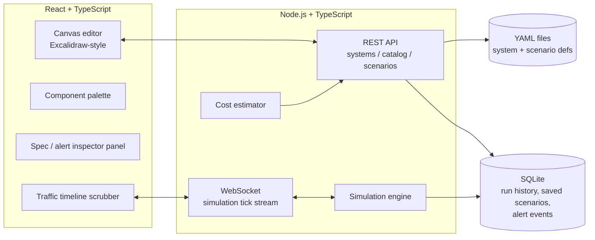

# Design Doc

## 1. Problem

Distributed-systems incidents (a downstream service slows down, a queue
backs up, a cache stampede hits the DB) are hard to reason about and even
harder to reproduce safely. Postmortems describe them in prose; nobody can
*see* the cascade. Separately, system design (for interviews, RFCs,
architecture reviews) is usually done on a generic whiteboard tool that has
no idea what a Kafka topic or an API gateway actually behaves like.

**Goal:** one tool that is both.

1. A visual canvas for defining real distributed-system topologies out of a
   fixed palette of real components (microservices, monoliths, CDNs,
   distributed DBs, Kafka/event streams, API gateways, load balancers,
   frontend clients...).
2. A simulator that plays traffic through that topology, animates the
   request/data flow, and lets you change one component's behavior live
   (e.g. bump a service's average latency from 50ms to 500ms) and watch how
   the change propagates and which alerts fire.
3. A library of preset architectures and preset incident scenarios so
   patterns (cascading failure, thundering herd, connection-pool
   exhaustion...) can be reproduced and studied on demand.

## 2. Core concepts

| Concept | What it is |
|---|---|
| **Component catalog** | Fixed, repo-controlled list of supported real-world component *types*. The canvas only ever offers this palette — you can't draw an arbitrary shape, only a supported component. |
| **System definition** | A YAML file describing one topology: a set of component instances (each an independent node with specs) and the edges between them. |
| **Scenario** | A YAML file describing traffic over time against a system definition: baseline load, load changes, and fault injections (e.g. "at t=30s set `orders-db` avg_response_time_ms to 500"). |
| **Simulation engine** | Runs a scenario against a system definition tick-by-tick, computes propagated latency/saturation at every component, evaluates alert rules, and streams the result to the frontend for animation. |
| **Alert rule** | A per-component, per-metric threshold (p99 latency, error rate, saturation...) that fires a visible alert when crossed during simulation. |
| **Cost estimator** | Maps a system definition's component specs to a rough monthly cloud cost. |

## 3. Architecture



- **YAML files are the source of truth** for system/scenario designs —
  human-readable, diffable, portable, git-versionable, shareable outside the
  app.
- **SQLite** stores things that aren't part of the design itself: simulation
  run history, saved/named scenario runs, fired alert events.
- **Component catalog** (`components/catalog.yaml`) is a single fixed file
  in the repo, not user-editable at runtime — extending the supported
  component list is a PR, not an app feature.

## 4. System definition schema

Each component is an independent node keyed by a stable id. Edges are
expressed as outbound `connects_to` references to other component ids —
this keeps the file diffable (moving/renaming an edge only touches the two
components involved) and lets the engine build a directed dependency graph
by scanning all nodes.

```yaml
# examples/systems/sample-ecommerce.yaml
version: 1
name: Sample E-commerce Microservices
description: Client -> gateway -> order service -> db + async event stream

components:
  web-client:
    type: frontend-client
    tech: react-spa
    specs:
      avg_response_time_ms: 0   # entrypoint, not a service being measured
    connects_to:
      - target: api-gateway
        protocol: https
        avg_payload_kb: 3

  api-gateway:
    type: api-gateway
    tech: kong
    specs:
      avg_response_time_ms: 5
      max_rps: 5000
    connects_to:
      - target: order-service
        protocol: http
        avg_payload_kb: 2
    alerts:
      - metric: p99_latency_ms
        threshold: 200
        severity: warning

  order-service:
    type: microservice
    tech: node-express
    specs:
      instances: 3
      cpu_cores: 1
      mem_mb: 512
      avg_response_time_ms: 50
      max_concurrent_workers: 100
    connects_to:
      - target: orders-db
        protocol: tcp
        avg_payload_kb: 1
      - target: order-events
        protocol: kafka
        avg_payload_kb: 1
    alerts:
      - metric: p99_latency_ms
        threshold: 300
        severity: warning
      - metric: error_rate
        threshold: 0.05
        severity: critical

  orders-db:
    type: distributed-db
    tech: postgres-citus
    specs:
      avg_response_time_ms: 15
      max_connections: 200
    alerts:
      - metric: saturation
        threshold: 0.9
        severity: critical

  order-events:
    type: event-stream
    tech: kafka
    specs:
      partitions: 6
      avg_response_time_ms: 8
```

**Field reference**

- `type` — must match an id in the component catalog (§5).
- `tech` — free-text label for what's actually running (shown in the UI,
  not used by the simulation math).
- `specs` — numeric knobs the simulation engine reads. Common ones:
  `avg_response_time_ms`, `instances`, `cpu_cores`, `mem_mb`,
  `max_concurrent_workers`, `max_rps`, `max_connections`. Unrecognized specs
  are allowed and just carried through (e.g. for the cost estimator or
  future metrics).
- `connects_to` — list of outbound edges: `target` (component id),
  `protocol`, `avg_payload_kb`.
- `alerts` — list of `{metric, threshold, severity}` evaluated against that
  component's live simulated metrics on every tick.

## 5. Component catalog schema

`components/catalog.yaml` is the fixed palette the canvas draws from.

```yaml
categories:
  client:
    - id: frontend-client
      label: Frontend Client
      default_specs: { avg_response_time_ms: 0 }
  networking:
    - id: api-gateway
      label: API Gateway
      default_specs: { avg_response_time_ms: 5, max_rps: 5000 }
    - id: load-balancer
      label: Load Balancer
      default_specs: { avg_response_time_ms: 1, max_rps: 20000 }
    - id: cdn
      label: CDN
      default_specs: { avg_response_time_ms: 20, cache_hit_ratio: 0.9 }
  compute:
    - id: microservice
      label: Microservice
      default_specs: { instances: 1, cpu_cores: 1, mem_mb: 256, avg_response_time_ms: 50, max_concurrent_workers: 50 }
    - id: monolith
      label: Monolith
      default_specs: { instances: 2, cpu_cores: 4, mem_mb: 2048, avg_response_time_ms: 80, max_concurrent_workers: 200 }
  data:
    - id: relational-db
      label: Relational DB
      default_specs: { avg_response_time_ms: 10, max_connections: 100 }
    - id: distributed-db
      label: Distributed DB
      default_specs: { avg_response_time_ms: 15, max_connections: 200 }
    - id: cache
      label: Cache
      default_specs: { avg_response_time_ms: 1, max_connections: 5000 }
  messaging:
    - id: event-stream
      label: Event Stream (Kafka-style)
      default_specs: { partitions: 3, avg_response_time_ms: 8 }
    - id: message-queue
      label: Message Queue
      default_specs: { avg_response_time_ms: 5, max_in_flight: 1000 }
```

Each entry additionally carries an `icon` field once the frontend palette is
built (omitted above for brevity). Adding a new component type is a change
to this one file plus (later) an icon asset.

## 6. Scenario / traffic definition schema

```yaml
# examples/incidents/db-latency-spike.yaml
version: 1
name: Orders DB Latency Spike
description: Baseline traffic, then orders-db degrades for 60s under load.
target_system: sample-ecommerce
entrypoint: web-client

baseline:
  rps: 200

timeline:
  - at_seconds: 0
    rps: 200
  - at_seconds: 30
    rps: 200
    inject_fault:
      component: orders-db
      set_specs:
        avg_response_time_ms: 500
    duration_seconds: 60
  - at_seconds: 90
    rps: 200
    clear_fault:
      component: orders-db
```

- `timeline` entries are checkpoints; the engine linearly interpolates `rps`
  between them.
- `inject_fault` overrides one or more `specs` on a target component for
  `duration_seconds` (or until `clear_fault` / end of run).
- Same shape supports both "burst traffic" scenarios (just `rps` changes)
  and "incident" scenarios (`inject_fault`), and the two can combine.

## 7. Simulation engine

Runs as a discrete tick loop (default: 1 tick = 1 simulated second,
configurable playback speed).

1. **Load propagation** — starting at `entrypoint`, push the current `rps`
   through the dependency graph (`connects_to` edges), splitting/merging at
   fan-out/fan-in points.
2. **Latency computation** — per component, effective response time is a
   simple queueing approximation: `effective_ms = avg_response_time_ms /
   (1 - min(utilization, 0.99))`, where `utilization = incoming_rps /
   max_rps_equivalent(specs)`. This is intentionally a coarse M/M/1-style
   approximation, not a full discrete-event simulator — good enough to show
   *that* things degrade and cascade, not to produce production-grade
   capacity planning numbers.
3. **Propagation** — a component's outbound edges see load only after the
   component itself responds, so a slow node visibly backs up everything
   downstream of it in the animation and inflates the p99 seen by everything
   upstream of it.
4. **Alert evaluation** — after each tick, every component's `alerts` are
   checked against that tick's computed metrics; a crossed threshold emits
   an alert event (persisted to SQLite, streamed to the frontend).
5. **Streaming** — each tick's per-component metrics + fired alerts are
   pushed to the frontend over WebSocket for the canvas animation and the
   alert panel.

## 8. Frontend UX

- Canvas modeled after Excalidraw's interaction model (pan/zoom, drag,
  connect nodes) but the palette is a fixed list of catalog components
  instead of freeform shapes.
- Selecting a component opens an inspector panel to edit its `specs` and
  `alerts` live.
- A timeline scrubber plays/pauses/steps through a loaded scenario;
  dragging it live-previews traffic at that point in time.
- Edges animate (particles/pulses) proportional to current simulated rps;
  a component under alert gets a visible badge/glow, color-coded by
  severity.
- "Live tweak" mode: while a simulation is running, changing a component's
  spec in the inspector immediately re-computes and re-animates downstream
  effects — this is the core "click one service, set 50ms → 500ms, watch it
  cascade" interaction from the mission statement.

## 9. Backend API surface

REST (system/catalog/scenario CRUD + cost estimate):
- `GET /api/catalog`
- `GET/POST /api/systems`, `GET/PUT/DELETE /api/systems/:id`
- `GET/POST /api/scenarios`, `GET/PUT/DELETE /api/scenarios/:id`
- `POST /api/systems/:id/cost-estimate`

WebSocket (simulation):
- `WS /ws/simulate` — client sends `{system_id, scenario_id, speed}` to
  start; server streams `{tick, metrics_by_component, alerts_fired}` per
  tick; client can send live `spec_override` messages mid-run for the
  "live tweak" interaction.

## 10. Persistence

- **YAML files** (`examples/**` bundled, plus user-created ones under a
  user data directory) are the portable, git-friendly source of truth for
  designs and scenarios.
- **SQLite** (`better-sqlite3`) holds: simulation run history, named saved
  scenario runs, fired alert events. Never the designs themselves — those
  stay as YAML so they can be copied/diffed/shared independent of the app.

## 11. Cost estimator

A small heuristic pricing table (`$/instance/hour` by rough size class,
`$/GB` for storage-ish components, `$/million messages` for
streams/queues) multiplies against each component's `specs` (instances,
cpu/mem tier, throughput) to produce a rough monthly estimate per component
and a system total. Explicitly labeled as a ballpark, not a quote.

## 12. Presets

- `examples/systems/` — reference architectures (3-tier web app, event-driven
  order pipeline, CDN + origin, Kafka fan-out...).
- `examples/incidents/` — reference incident scenarios (DB connection-pool
  exhaustion, cascading downstream degradation, cache-stampede thundering
  herd, burst traffic without autoscaling...).

Both are loaded read-only in the UI as a "start from a preset" gallery.

## 13. Tech stack

| Layer | Choice |
|---|---|
| Frontend | React + TypeScript + Vite |
| Canvas | Custom SVG/Canvas renderer (Excalidraw-style interactions) |
| Backend API + sim engine | Node.js + TypeScript + Fastify |
| Design/scenario storage | YAML files |
| Run history / saved state | SQLite (`better-sqlite3`) |
| Cloud hosting | Terraform (provisioning) + Ansible (config/deploy) |
| Local dev/preview | Makefile wrapping frontend + backend dev servers |

## 14. Roadmap

- **M0** — repo scaffold, docs, component catalog + example YAML (this).
- **M1** — static canvas: render a system definition YAML read-only on the
  canvas (no editing, no simulation).
- **M2** — CRUD: create/edit systems and scenarios through the UI, persisted
  as YAML; backend REST API; SQLite wired up.
- **M3** — simulation engine v1: run a scenario against a system, compute
  propagated metrics tick-by-tick, no animation yet (numbers/table view).
- **M4** — live animation + alerts: WebSocket tick streaming, animated
  canvas, alert badges, live spec-tweak-while-running.
- **M5** — scenario/traffic editor UI + preset gallery (bundled
  architectures + incidents).
- **M6** — cost estimator.
- **M7** — Terraform/Ansible deploy to a real host; Makefile `make deploy`.
